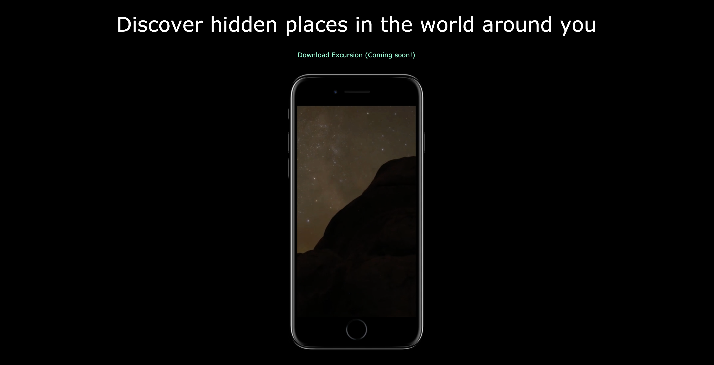
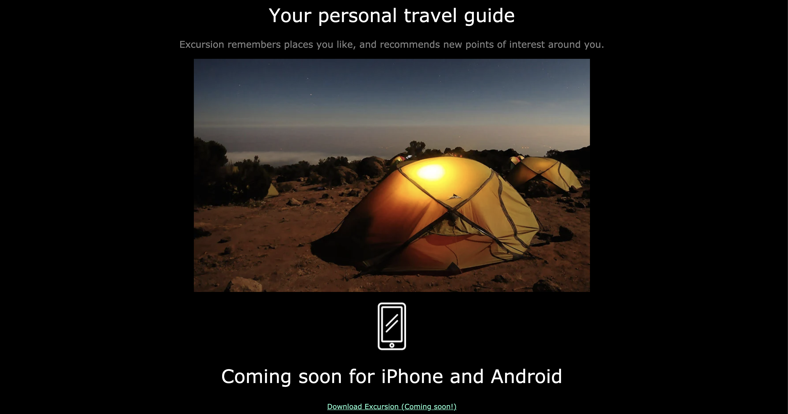

# Excursion

## Description 
Codecademy's Excursion project on their Full Stack Engineer path way to display knowledge of HTML/CSS. This project was given as a design to implement a static webpage to use version control/git and Github pages hosting.

## Table of Contents
* [Installation](#installation)
* [Usage](#usage)
* [License](#license)
* [Contributing](#contributing)
* [Tests](#tests)
* [Questions](#questions)

## Installation 
No installation required, but user can clone repository. 

## Usage 
This application is based on the wireframe below:

The site I created: 

Site is hosted on [Github Pages](nicolewallace09.github.io/excursion/)

## License 
This project is license under MIT

## Contributing 
This is a project from Codecademy's Full Stack Engineer career path. 

## Tests
There are no tests for this application. 

## Questions
If you have any questions about this projects, please contact me directly at nicole.elisaw@gmail.com. You can view more of my projects at https://github.com/nicolewallace09.